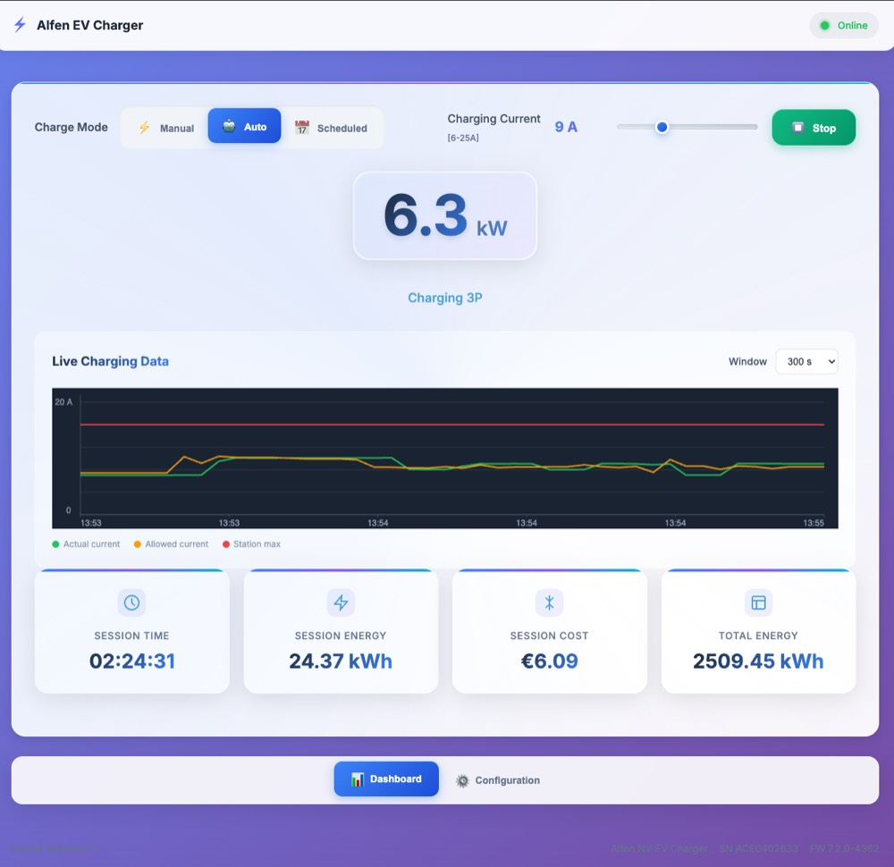
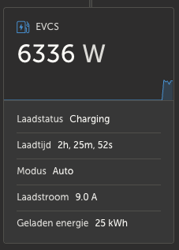
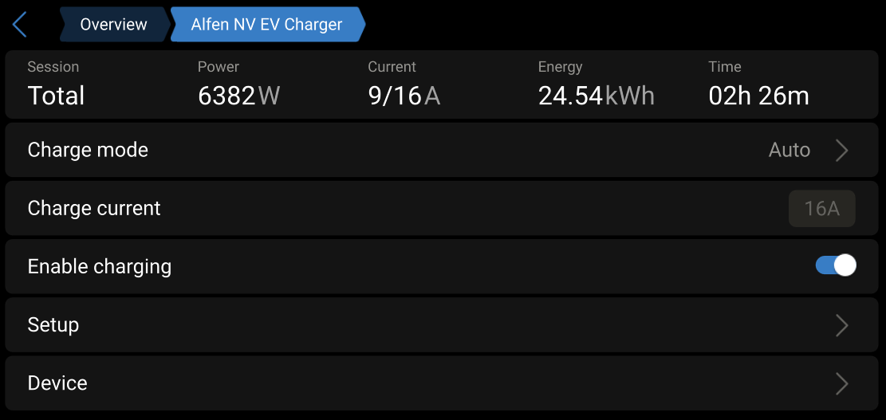
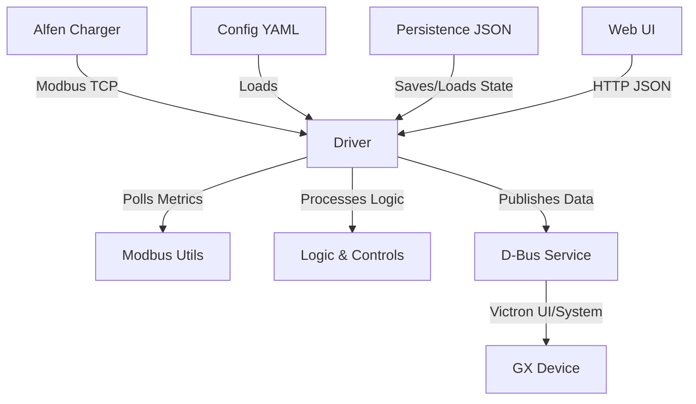

# Victron–Alfen Charger Integration

Integrate an Alfen Eve (Pro Line and similar NG9xx platform) EV charger with a Victron GX device (Venus OS) using Modbus TCP and D‑Bus. The charger is exposed as a first‑class EV charger in the Victron ecosystem.

## Preview


The built‑in web UI dashboard with live charging power, mode controls (**Manual**, **Auto**, **Scheduled**), a charging‑current slider, Start/Stop button, a live graph of actual vs allowed current (and station max), plus session tiles for time, energy and cost.


Victron VRM widget showing the EV charger’s instantaneous power, charging status, elapsed charge time, active mode, charging current and energy delivered.


Victron GX device page for the charger with session totals (power, current vs limit, energy and time). Provides quick access to charge mode, charge current, the enable/disable toggle, setup and device information.

## Features

- MANUAL, AUTO (excess‑solar), and SCHEDULED modes
- Optional Tibber dynamic pricing support in SCHEDULED mode (level/threshold/percentile strategies)
- Robust Modbus reads/writes with retries and reconnection
- D‑Bus service: `com.victronenergy.evcharger.alfen_<device_instance>`
- Exposes key paths: `/Mode`, `/StartStop`, `/SetCurrent`, `/MaxCurrent`, `/Ac/Current`, `/Ac/Power`, `/Ac/Energy/Forward`, `/Status`, phase voltages/currents/power
- Session tracking and energy accounting per charging session
- Structured logging to console and `/var/log/alfen_driver.log`
- Optional built‑in web UI with live metrics and controls (responsive)

## Requirements

- Python 3.8+
- Access to Alfen charger via Modbus TCP (slave)
- On Victron Venus OS: system libraries are preinstalled/provided (dbus, gi/GLib, vedbus)
- Python packages (installed via pip):
  - `pymodbus==3.6.4`
  - `pyyaml>=6.0.1`
  - `pytz`
  - Optional: `aiohttp<4` for faster Tibber API

See `requirements.txt` and `requirements-dev.txt`.

Note for GX devices: Run the driver in a dedicated Python virtual environment and avoid installing requirements into the system Python. The built‑in two‑way communication service expects an older `pymodbus` and may break if system packages are upgraded. Keep system packages untouched; install this project's deps only inside the venv.

## Quick start (local testing)

1) Clone and enter the repo

```bash
git clone https://github.com/yourusername/victron-alfen-charger.git
cd victron-alfen-charger
```

2) Create a virtualenv and install deps

```bash
python3 -m venv .venv
source .venv/bin/activate
pip install -r requirements.txt
```

3) Configure

```bash
cp alfen_driver_config.sample.yaml alfen_driver_config.yaml
# Edit alfen_driver_config.yaml and set at least:
# modbus.ip: "<your-charger-ip>"
```

4) Run driver (on a system with D‑Bus available)

```bash
python3 main.py
```

5) Modbus-only smoke test (no D‑Bus)

```bash
# Edit ALFEN_IP in test_modbus.py first
python3 test_modbus.py
```

## Running on Victron GX (Venus OS)

1) Enable SSH (Venus OS Settings → Services → SSH) and log in as `root`

2) Install system prerequisites (Python + D‑Bus bindings)

```bash
opkg update
opkg install git python3 python3-pip python3-dbus python3-pygobject
```

3) Fetch code and configure

```bash
cd /data
git clone https://github.com/yourusername/victron-alfen-charger.git
cd victron-alfen-charger
cp alfen_driver_config.sample.yaml alfen_driver_config.yaml
vi alfen_driver_config.yaml   # set modbus.ip and other fields as needed
chmod +x main.py
```

4) Create a virtualenv that inherits system site‑packages (for dbus/gi), then install Python deps (pymodbus 3, etc.)

```bash
/usr/bin/python3 -m venv --system-site-packages /data/alfen-venv
. /data/alfen-venv/bin/activate
pip install -U pip setuptools wheel
pip install -r /data/victron-alfen-charger/requirements.txt
```

Alternative (if you expose D‑Bus/GLib into the venv differently): a dedicated venv without `--system-site-packages` may work, but you must ensure `dbus` and `gi` are importable from that venv.

5) Test run (ensure Venus velib is on PYTHONPATH)

```bash
export PYTHONPATH=/opt/victronenergy/velib_python:$PYTHONPATH
/data/alfen-venv/bin/python3 /data/victron-alfen-charger/main.py
```

6) Auto‑start on boot (rc.local)

```bash
cat >/data/rc.local <<'EOF'
export PYTHONPATH=/opt/victronenergy/velib_python:$PYTHONPATH
/data/alfen-venv/bin/python3 /data/victron-alfen-charger/main.py &
EOF
chmod +x /data/rc.local
```

Notes:
- Using `--system-site-packages` makes the venv see system `dbus` and `gi` provided by opkg, while pip installs (e.g., `pymodbus 3`) live in the venv and override older system packages.
- If you need to bind the web UI beyond localhost, set environment variables:
  - `ALFEN_WEB_HOST=0.0.0.0` and optional `ALFEN_WEB_PORT=8088`

Logs: `/var/log/alfen_driver.log`

### Optional: Built‑in Web UI

- The driver starts a lightweight HTTP server on port 8088 (defaults to 127.0.0.1; override in config or via env).
- Configure binding in `alfen_driver_config.yaml`:

```yaml
web:
  host: "0.0.0.0"  # 127.0.0.1 for localhost only
  port: 8088
```

- Or via environment variables (override config): `ALFEN_WEB_HOST`, `ALFEN_WEB_PORT`
- Local access: `http://<venus-ip>:8088/ui/`
- API endpoints:
  - `GET /api/status` → JSON snapshot
  - `GET /api/config/schema` → UI schema
  - `GET /api/config` / `PUT /api/config` → full configuration
  - `POST /api/mode {"mode": 0|1|2}`
  - `POST /api/startstop {"enabled": true|false}`
  - `POST /api/set_current {"amps": number}`

VRM proxying:
- On Venus OS Large you can alternatively use Node‑RED dashboards which are auto‑proxied by VRM.
- For custom services on stock Venus OS, you can run a reverse proxy (e.g. Caddy/nginx) on the device and register it as a local service; consult Victron docs/community for `localservices.d`/GUI integration details.

### VRM Control Panel integration (open this UI via VRM)

By default VRM’s generic Control Panel button assumes port 80. The driver’s UI runs on 8088. You can make VRM open the UI without changing the system webserver by using a loopback alias and a NAT redirect:

1) Configure the driver to advertise a loopback alias that VRM can target:
```yaml
web:
  host: "127.0.0.2"  # loopback alias used only for VRM
  port: 8088          # actual UI port
```

2) Add the loopback alias and redirect 127.0.0.2:80 → 127.0.0.2:8088 on the GX:
```bash
# One‑time test (non‑persistent)
ip addr add 127.0.0.2/8 dev lo label lo:1 || true
iptables -t nat -C OUTPUT -p tcp -d 127.0.0.2 --dport 80 -j DNAT --to-destination 127.0.0.2:8088 2>/dev/null || \
iptables -t nat -A OUTPUT -p tcp -d 127.0.0.2 --dport 80 -j DNAT --to-destination 127.0.0.2:8088
```

3) Persist across reboots via `/data/rc.local` (before starting the driver):
```bash
ip addr add 127.0.0.2/8 dev lo label lo:1 || true
iptables -t nat -C OUTPUT -p tcp -d 127.0.0.2 --dport 80 -j DNAT --to-destination 127.0.0.2:8088 2>/dev/null || \
iptables -t nat -A OUTPUT -p tcp -d 127.0.0.2 --dport 80 -j DNAT --to-destination 127.0.0.2:8088
/data/alfen-venv/bin/python3 /data/victron-alfen-charger/main.py &
```

4) Restart the driver. When you click Control Panel in VRM, it should open the UI. The default system webserver on 0.0.0.0:80 is not affected because connections to 127.0.0.2:80 are rewritten to 8088 before delivery.

Alternative: register as a local service so VRM proxies the correct port directly. Create `/data/localservices.d/alfen.json`:
```json
{
  "name": "Alfen EV Charger",
  "port": 8088,
  "path": "/",
  "description": "Alfen EV Charger UI",
  "gzip": true,
  "auth": "none"
}
```
Then reboot the GX and use the local service entry from VRM.

## Configuration

- Primary file: `alfen_driver_config.yaml` (copy from the provided sample)
- Validated on startup with clear errors and suggestions
- Key sections:
  - `modbus`: `ip`, optional `port`, `socket_slave_id`, `station_slave_id`
  - `defaults`: `intended_set_current`, `station_max_current`
  - `controls`: verification tolerance, watchdog interval, retries, etc.
  - `schedule`: optional legacy time windows (used when Tibber disabled)
  - `tibber`: optional dynamic pricing integration and strategy
  - `logging`: level, file, rotation
  - `timezone`, `device_instance`, `poll_interval_ms`

Minimal example:

```yaml
modbus:
  ip: "192.168.1.100"

defaults:
  intended_set_current: 16.0
  station_max_current: 32.0

controls:
  max_set_current: 32.0
  current_tolerance: 0.5

timezone: "Europe/Amsterdam"
```

For a detailed, field‑by‑field guide (validation ranges, examples, troubleshooting), see `docs/configuration_guide.md`.

## Architecture overview



- Modbus polling: voltages, currents, power, energy, status
- Logic: mode handling (MANUAL/AUTO/SCHEDULED), low SOC checks, excess‑solar calculation, dynamic scheduling (Tibber or legacy windows)
- D‑Bus: exposes EV‑charger paths for the Victron UI and ecosystem
- Web UI: live snapshot and control endpoints (port 8088)

## D‑Bus interface (selected paths)

- `/Mode` (0=MANUAL, 1=AUTO, 2=SCHEDULED)
- `/StartStop` (0=disabled, 1=enabled)
- `/SetCurrent` (A)
- `/MaxCurrent` (A)
- `/Status` (0=Disconnected, 1=Connected, 2=Charging, 7=Low SOC; also WAIT_SUN/WAIT_START via UI state mapping)
- `/Ac/Current`, `/Ac/Power`, `/Ac/Energy/Forward`
- `/Ac/L{1,2,3}/Voltage`, `/Ac/L{1,2,3}/Current`, `/Ac/L{1,2,3}/Power`

Service name: `com.victronenergy.evcharger.alfen_<device_instance>`

## Development

- Make targets:
  - `make install` / `make install-dev`
  - `make test` / `make test-cov`
  - `make lint` / `make format` / `make type-check` / `make security`
  - `make pre-commit` / `make all`
- Tests: `pytest` with coverage (see `tests/` and `pyproject.toml` for settings)
- Style/quality: black, ruff, mypy, bandit, pre-commit hooks

## Troubleshooting

- Modbus connection failures
  - Verify `modbus.ip` (port 502), network reachability, and that Modbus TCP is enabled on the charger
- Register read errors / wrong values
  - Confirm register addresses match your firmware; adjust `registers` in config if needed
- Charger not visible in Victron UI
  - Ensure the process is running, check logs, and verify `device_instance` uniqueness
- Set current not applied
  - Check logs for write/verify warnings; increase retries/tolerances if network is flaky
- Low SOC behavior
  - In AUTO mode, charging pauses when Victron battery SOC < system minimum; adjust the minimum SOC in Victron settings

Logs: `/var/log/alfen_driver.log`. Enable DEBUG via `logging.level: DEBUG`.

## Notes & assumptions

- Designed for Alfen NG9xx platform; 1‑phase vs 3‑phase is auto‑detected from register 1215 (2‑phase treated as 3‑phase)
- Tibber integration is optional and used only when `tibber.enabled: true`
- Venus OS provides system D‑Bus and `vedbus`; these are not pip dependencies

## License

MIT License
