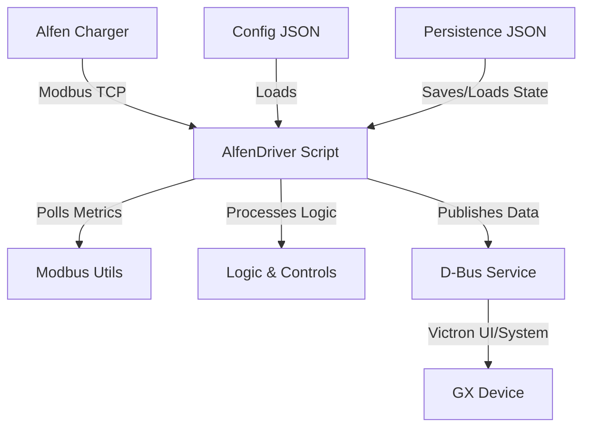

# Victron-Alfen-Charger Integration

This project provides a Python script to integrate an Alfen Eve Pro Line EV charger with a Victron GX device via Modbus TCP and DBus. The charger is exposed as a first-class EV charger in the Victron ecosystem.

## Requirements

- Python 3.6+
- pymodbus==3.6.4 (install via pip)
- Victron Venus OS (for driver.py)
- Access to Alfen charger via Modbus TCP (configured as slave)

## Files

- **driver.py**: Main script to run on Victron GX. Connects to Alfen via Modbus and publishes data to DBus.
- **test_modbus.py**: Test script to verify Modbus communication with Alfen charger locally on your PC.

## Setup

1. Clone the repository:

```bash
git clone https://github.com/yourusername/victron-alfen-charger.git
cd victron-alfen-charger
```

2. Create and activate a virtual environment:

```bash
python3 -m venv .venv
source .venv/bin/activate
```

3. Install dependencies:

```bash
pip install pymodbus==3.6.4
```

4. Update `ALFEN_IP` in the scripts to match your charger's IP address.

## Usage

### Testing Modbus Locally

Run the test script on your PC to check communication:

```bash
python3 test_modbus.py
```

It will poll and print charger data every 5 seconds.

### Running on Victron GX

Victron GX devices run Venus OS, a Linux-based system. You'll need SSH access enabled on the GX (via Settings > Services > SSH).

1. SSH into your Victron GX device (default username: root, set password in Venus OS settings).

2. Update package list and install required tools (git, python3, pip):

   ```bash
   opkg update
   opkg install git
   opkg install python3
   opkg install python3-pip
   ```

3. Clone the repository:

   ```bash
   cd /data
   git clone https://github.com/rhernaus/victron-alfen-charger.git
   cd victron-alfen-charger
   ```

4. Install pymodbus:

   ```bash
   pip3 install pymodbus==3.6.4
   ```

5. Configure the script:
   - Edit `driver.py` with a text editor (e.g., vi or nano; install nano if needed with `opkg install nano`).
   - Update `ALFEN_IP` to your charger's IP address.
   - Adjust other settings like slave ID or registers if necessary.

6. Make the script executable:

   ```bash
   chmod +x driver.py
   ```

7. Test the script manually:

   ```bash
   ./driver.py
   ```

   Check for errors and ensure it connects to the charger and publishes to DBus.

8. Set up as a persistent service:
   - Option 1: Add to `/data/rc.local` (create if it doesn't exist):
     ```bash
     echo '/data/victron-alfen-charger/driver.py &' >> /data/rc.local
     chmod +x /data/rc.local
     ```
   - Option 2: Create a systemd service (advanced):
     Create `/etc/systemd/system/alfen-driver.service`:

     ```ini
     [Unit]
     Description=Alfen EV Charger Driver
     After=multi-user.target

     [Service]
     ExecStart=/data/victron-alfen-charger/driver.py
     Restart=always

     [Install]
     WantedBy=multi-user.target
     ```

     Then:

     ```bash
     systemctl daemon-reload
     systemctl enable alfen-driver.service
     systemctl start alfen-driver.service
     ```

9. Reboot the GX device:

   ```bash
   reboot
   ```

10. Verify in the Victron interface: The charger should appear under Devices as "Alfen Eve Pro Line".

If issues arise, check logs with `systemctl status alfen-driver` (if using systemd) or debug manually.

## Notes

- The script assumes 3-phase configuration; adjust if needed.
- For production, add error handling, logging, and configuration options.
- Ensure the Alfen charger is set up with Active Load Balancing and Modbus TCP enabled.

## License

MIT License (or specify your license).

## Architecture Overview

The driver bridges the Alfen charger (via Modbus TCP) and Victron's Venus OS (via D-Bus). Here's a high-level diagram:



- **Modbus Polling**: Reads registers for voltages, currents, etc.
- **Logic**: Computes effective current, handles modes (Manual/Auto/Scheduled), low SOC, scheduling.
- **D-Bus**: Exposes paths like /Ac/Power for Victron integration.

## Assumptions

- **Hardware**: Assumes a 3-phase Alfen Eve Pro Line charger. Single-phase setups may report 0/NaN for unused phases, but the code doesn't dynamically adapt—manual config adjustments may be needed.
- **Environment**: Designed for Victron Venus OS on GX devices. Requires SSH access, opkg-installed tools (git, python3, pip), and paths like /opt/victronenergy/dbus-modbus-client.
- **Charger Setup**: Alfen charger must have Modbus TCP enabled as slave, with Active Load Balancing configured if needed.
- **Dependencies**: Specific versions (e.g., pymodbus==3.6.4) for compatibility. D-Bus paths (e.g., /Dc/Battery/Soc) assume a standard Victron battery setup.
- **Network**: Charger IP is static and reachable; no dynamic discovery.

## Troubleshooting

Common issues and fixes:

- **Modbus Connection Failures**:
  - Symptom: Logs show "Failed to connect" or "Poll error: ConnectionException".
  - Fix: Verify ALFEN_IP in config.json, ensure charger Modbus TCP is enabled (port 502), check network (ping the IP). Restart the script or device.

- **Register Read Errors** (e.g., "Error reading registers at X"):
  - Symptom: Data like voltages show 0 or NaN persistently.
  - Fix: Confirm register addresses match Alfen docs (reference/Implementation_of_Modbus_Slave_TCPIP_for_Alfen_NG9xx_platform.pdf). Slave IDs (1 for socket, 200 for station) may need adjustment in config.json.

- **D-Bus Issues**:
  - Symptom: Charger not appearing in Victron UI, or "Unable to connect to battery SOC D-Bus path".
  - Fix: Ensure the script is running (check systemctl status or ps aux). Verify device_instance in config doesn't conflict. For SOC, confirm /Dc/Battery/Soc path exists (use dbus -y com.victronenergy.system /Dc/Battery/Soc GetValue).

- **Current Not Setting**:
  - Symptom: SetCurrent callbacks fail, or effective current doesn't match intended.
  - Fix: Check logs for "SetCurrent write failed". Verify station max current (register 1100). Increase retries/tolerances in config if network is flaky.

- **General Debugging**:
  - Check logs: tail -f /var/log/alfen_driver.log
  - Test Modbus: Run test_modbus.py on a PC to verify communication.
  - Restart: systemctl restart alfen-driver (if using systemd) or reboot the GX.
  - If issues persist, enable DEBUG logging in config.json and share logs.
